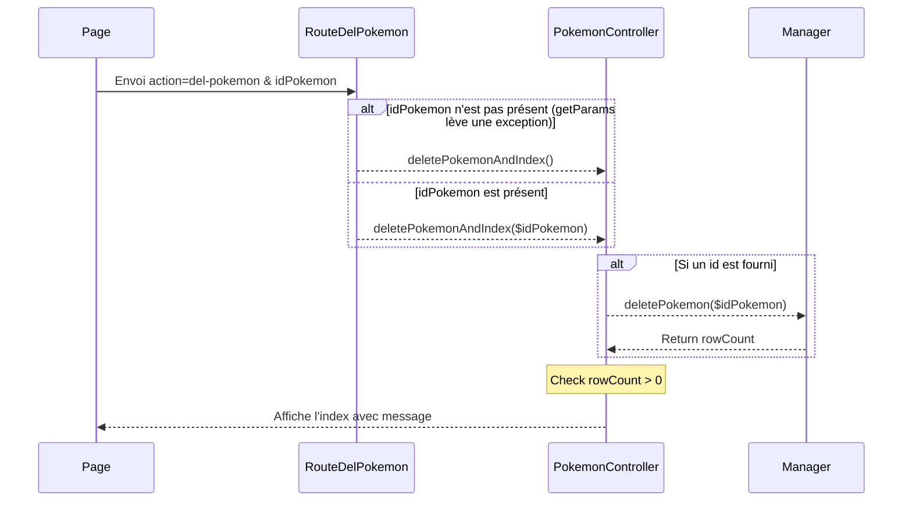
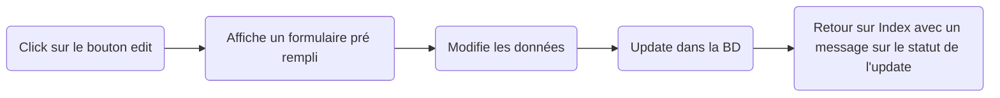

# P4 : Génèse et Destruction !

Il est grand temps de pouvoir créer, modifier et supprimer des pokemon !

```text
Durant tout le TP, vous allez voir apparaitre la notion de message. 
Ceci implique de retourner une information à l'utilisateur sur comment s'est déroulé le processus demandé.
Si cela vous bloque durant le TP, vous pouvez y revenir plus tard. 
Mieux vaut un CRUD qui marche sans message que bloquer jusqu'à la fin pour afficher un message !
```

## 1 - Et ainsi l'pokemon est

**1.1 :** Retournons sur notre formulaire d'ajout d'pokemon. Il est temps de déterminer la méthode et l'action dans notre balise *form*. Comme nous allons créer une donnée, les recommandations du protocole *HTTP* demandent d'utiliser *POST*. Cela permet d'utiliser la même route que l'affichage du formulaire. Nous n'aurons qu'à regarder si nous avons des données *$_POST* pour savoir si on doit gérer l'ajout.

```html
<form action="index.php?action=add-pokemon" method="post">
```

```text
Attention, le formulaire HTML ne peut gérer que les méthodes *POST* et *GET*.
```

Pour exploiter notre formulaire, chaque champs input devra posséder un attribut *name*. Sa valeur déterminera le nom de notre clé dans *$_POST*.

**1.2 :** Pour anticiper une erreur dans les données envoyées par le formulaire (donnée incorrect ou champ inexistant), nous allons préparer notre page à accueillir un message d'erreur.

Dans la fonction *displayAddPokemon* (TP7), il faut ajouter un paramètre optionnel (pour ne pas casser notre code déjà en place) de type *?string* à valeur *null* par défaut.

**Exemple :**
```php

function func(?type $varOptionnelle = valeurParDefaut)

```


Celui-ci sera passé à la fonction *generer* avec une clé nommé *message* par exemple. Cela vous donnera accès à une variable *$message* dans votre *vueAddPokemon*. Si celle-ci existe, vous pourrez afficher la valeur de la variable en guise de message d'erreur.

```text
Comme d'habitude, évitez de juste faire un appel à *echo* de votre message et retourner du HTML/CSS.
```

**1.3 :** Dans notre contrôleur *Pokemon*, nous allons créer une fonction *addPokemon* qui aura pour but de :

1. Prendre les infos d'un pokemon en entrée (*Array* ou multi variable)
2. Créer le pokemon
    - Créer une fonction *createPokemon(Pokemon)* qui insère un pokemon en BD dans notre *PokemonManager*
    - Récupère l'*ID* fraichement crée pour l'ajouter à notre *Pokemon* passé en paramètre
    - Retourne le *Pokemon*
3. Créer un message sur la réussite (ou non) de la création
4. Générer une page *Index* avec le message

```text
Pour récupérer l'ID du dernier élément inséré en MySQL, 
je vous recommande de faire une 2ème requête avec *SELECT LAST_INSERT_ID()*.
```

**1.4 :** Il est temps de retravailler notre routeur pour gérer les données `$_POST` envoyé par notre formulaire. N'hésitez pas à utiliser la fonction var_dump sur la variable `$_POST` pour identifier comment celui-ci fonctionne.

Il est recommandé d'utiliser la fonction getParam de notre classe Route. 
Il faudra faire un array avec les clés correspondant aux attribut de votre classe Pokemon et les remplir avec les informations de votre formulaire

```php
$data = [
  "nomEspece" => parent::getParam($params, "pokemon-nom",false),
  ...
]
```

Il est temps d'implémenter l'algorithme qui permettra de choisir ce que l'on affiche.
Nous seront directement dans la méthode post de notre route

```text
Dans notre fonction post
  -> Récupérer toutes les clés nécessaires
  -> Si une exception est levée
    -> Afficher le formulaire avec un message 
  -> Sinon
    -> Envoyer les données au contrôleur
```


## 2 - Et maintenant le pokemon changera ou ne sera point

**2.1 :** Si vous êtes un bon étudiant qui aime tester les choses pour vérifier que tout fonctionne, vous devriez avoir pléthore de pokemon dans votre BD qui s'appellent Test. 
On va donc préparer la suppression pour *clean up* un peu tout cela.

Voici en résumé notre fonctionnalité :




Niveau modèle, rien de compliqué, une méthode *deletePokemon(int $idPokemon = -1)* à implémenter dans le *manager*.

```text
Envie de savoir si la suppression s'est bien passée ? 
Regardez du côté de PDOStatement::rowCount() pour vous aider.
```

Niveau contrôleur, une méthode (soyons explicite) *deletePokemonAndIndex(int $idPokemon)*. Comme son nom l'indique, on supprime le pokemon (coucou le manager) puis on génère une vue *Index* avec un message (Suppression réussie ou non).

```text
Si vous vous souvenez, cette fonction a déjà été créée au TP3 Q2.5. 
Elle aura peut-être un nom différent. 
Ce n'est pas un problème, tant que vous restez cohérent dans votre programme 
(vous pouvez aussi la renommer dans tout votre projet !) 
```

Puis niveau routeur, vous devriez avoir créé le bouton supprimer qui doit avoir un lien de cette forme :

```html
index.php?action=del-pokemon&idPokemon=1
```

A vous de jouer pour :

1. Traiter l'action get dans votre RouteDelPokemon
2. Récupérer l'*id* depuis l'*url* (*hint:* Les infos de l'url sont passé par la méthode *GET*)
3. En cas d'erreur (l'*url* ne contient pas la donnée par exemple), appeler la fonction *deletePokemonAndIndex* mais sans paramètres
4. Appeler votre super méthode du contrôleur avec l'id en param.

```text
Il est fort possible que, à ce stade du TP, 
votre fonction index ne gère pas un message. 
Si tel est le cas, pour éviter de casser votre code, 
ajouter un paramètre optionnel à votre méthode index. 
Puis passez ce paramètre à la fonction 'generer'. 
```

**2.2 :** Marre de supprimer tous ces pokemon tests ? Peut-être qu'il est temps de voir pour mettre à jour nos données. Voici le process que l'on voudrait :




Cette fonction étant plus complexe, nous allons la couper en 2. Pour le moment, l'objectif est d'afficher le formulaire *add-pokemon* rempli des infos du pokemon que l'on veut modifier.

Dans le routeur, le procédé se déroule comme la fonction de suppression. 
Si le paramètre *idPokemon* n'existe pas, nous pouvons utiliser la méthode *displayAddPokemon("id not found")* au lieu de *displayEditPokemon($idPkmn)*

Dans le contrôleur, nous avons une méthode *editPokemon*. Nous allons la renommer en *displayEditPokemon* vu que celle-ci ne fera qu'afficher le formulaire rempli. Elle aura besoin de l'*id* du pokemon en paramètre.

Il ne manquera plus qu'à récupérer le pokemon, et générer une vue *addPokemon* avec le pokemon en paramètre

C'est au niveau de la vue que cela devient plus complexe.

0. Pour chacune des actions ci-dessous => Vérifier si un pokemon existe
1. Préremplir chacun des champs avec sa valeur correspondante.
2. Ajouter un champs caché contenant l'*ID*.
3. Changer l'action du formulaire en *edit-pokemon*
4. Changer le titre de la page
5. Changer le texte du bouton

```text
Votre code html parsemé de PhP peut vite devenir illisible ! 
N'hésitez pas à utiliser l'outil de formatage de votre IDE 
et de bien indenter votre code !
```

**2.3 :** Maintenant que nous avons préparé le terrain, il est temps de faire l'*update* a proprement parler.

Pour ne pas trop compliquer la tâche, nous allons update tous les champs d'un coup sans se soucier s'ils ont été modifiés ou non (à l'exception de l'*id* bien évidemment).

Pour le *Manager*, la fonction *editPokemonAndIndex(array $dataPokemon)* se chargera de mettre à jour la base de donnée.

Pour le contrôleur, le processus est similaire à ce que l'on a vu avant :

0. On crée notre méthode *editPokemonAndIndex(array $dataPokemon)*
1. On crée notre pokemon
2. On l'envoi au *manager* qui fait l'*Update*
3. On vérifie si les 2 types sont les même, si oui, alors le 2ème type peut être null
4. On génère un message en fonction du résultat
5. On génère notre vue *Index* avec le message

```text
Nous générons beaucoup de fois une page Index. 
Or ce code existe déjà dans notre MainController. 
Il serait bon de s'en servir. 
N'hésitez pas à utiliser un paramètre de votre PokemonController que vous instanciez dans sa méthode __construct(). 
Vous pouvez ainsi disposer de ses méthodes et invoquer l'index.
```

Pour le routeur, après avoir vérifié que nous possédons bien des données *POST*, nous récupérons ce qui est nécessaire via *getParam*. 
Puis, on transmet sous forme d'un *array* à notre contrôleur.

Et si tout fonctionne, nous devrions maintenant avoir un processus fonctionnel. N'oubliez pas de gérer l'exception si un paramètre obligatoire est manquant

## 3 - Récap

Nous avons déjà bien avancé à ce stade. Si tout est fonctionnel, bien codé, et avec une pointe de *design* qui permet de ressembler plus à un site web qu'à une expérimentation d'un doctorant, vous pouvez espérer une note très correcte !

Il est temps de faire le point sur l'avancée. Au niveau de l'architecture du projet, cela devrait ressembler à cela (Le bonus décrit après est inclus.).

```text
📦 TonSuperProjet
 ┣ 📂config
 ┃ ┣ 📜Config.php
 ┃ ┗ 📜dev.ini
 ┣ 📂controllers
 ┃ ┣ 📜PokemonController.php
 ┃ ┣ 📜MainController.php
 ┃ ┗ 📜TypeController.php (optionnel)
 ┣ 📂helpers
 ┃ ┗ 📜Message.php
 ┣ 📂models
 ┃ ┣ 📜Pokemon.php
 ┃ ┣ 📜PokemonManager.php
 ┃ ┗ 📜Model.php
 ┣ 📂public
 ┃ ┣ 📂css
 ┃ ┃ ┗ 📜main.css
 ┃ ┗ 📂img
 ┣ 📂views
 ┃ ┣ 📜gabarit.php
 ┃ ┣ 📜message.php
 ┃ ┣ 📜View.php
 ┃ ┣ 📜vueAddPokemon.php
 ┃ ┣ 📜vueAddType.php
 ┃ ┣ 📜vueIndex.php
 ┃ ┗ 📜vueSearch.php
 ┗ 📜index.php
```

Evidemment, certains fichiers peuvent différer, comme les noms des fonctions/classes.

Faisons un récap de ce que l'on attend de notre application.

- [x] Afficher la liste des pokemon
- [x] Ajouter des pokemon à la BD
- [x] Editer un pokemon
- [x] Supprimer un pokemon
- [ ] Rechercher un pokemon particulier
- [ ] Gérer un modèle de type
- [x] Avoir un design simple et fonctionnel
- [ ] Plein de bonus

On a bien avancé et l'objectif du prochain TP sera de cocher 2 points de plus !

## 4 - Bonus

Il serait agréable de gérer nos messages de façons plus détaillé. Effectivement, nous envoyons un texte et ... puis c'est tout. Ajouter peut-être un titre au message et changer sa couleur (via des classes CSS) suivant son contenu (Bleu pour les infos, Rouge pour les erreurs, Vert pour les succès).

Pour éviter la duplication de code, je vous invite à créer un fichier */views/message.php* qui se chargera du *template* du message.

Il ne manquera plus qu'à inclure ses fichiers dans vos *templates* de page à l'aide d'un simple :

```php
<?php include('message.php') ?>
```

Si l'on veut pousser encore plus loin, au lieu de gérer plusieurs variables, il serait temps de créer une classe *Message* dans un dossier *helpers* par exemple ;)

<center>
<Mermaid chart={`classDiagram
class Message{
    -string $message
    -string $color
    -string $title
    __construct(string $message, string $color, string $title)
}
`} />
</center>

Vous pouvez donner des valeurs par défaut surtout pour *color* si vous utilisez un framework css. Mais aussi utiliser des constantes pour ne pas avoir à taper le nom de vos couleurs à chaque fois.

Exemple pour *materialize*:

```php
const MESSAGE_COLOR_SUCCESS = "green lighten-2";
const MESSAGE_COLOR_ERROR = "red lighten-2";

public function __construct(string $message, string $color="light-blue lighten-1", string $title="Message")
```